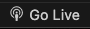
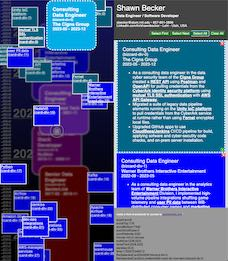

# flock-of-postcards  
# dark, chaotic, and deep  

This`flock-of-postcards` web app is a visualization tool use to explore a person's work history, education, and skills as defined in a standard resume.

The tool is meant to be rather chaotic, so I hope the following explaination helps.

# Experience the flock

Large `business cards`are used to describe various jobs, each with its role, employer, and time period. The size of each `biz card` is defined by its start and end dates. These cards are large, massive, slow moving, and far away from your view, and each `biz card` is surrounded by its flock of smaller `skill cards`that hovers around it.

The left panel contains the interactive `card viewer`. The right panel contains the `details viewer`, which shows details of previously selected cards.

Scroll the mouse vertically in the `card viewer` to slide over the `timeline`. The cursor attracts the `point-of-view`, shown as a `bulls-eye`  that has mass and inertia. The resulting`motion parallax` and fuzzy `depth of field` give the flock its sense of 3-D depth. 

Click on a `biz card` or `skill card` to make it pop it into focus at the top of the flock in the `flock viewer`, and to see its details pop into view in the right-hand `details viewer`. 

# Download and build the flock

- Clone this repo to your local development folder:   
`cd <your-local-dev-folder>`  
`git clone git@github.com:sbecker11/flock-of-postcards.git`  
`cd ./flock-of-postcards`  

The `flock-of-postcards` webapp uses ES6 Modules. This requires that you have an ultra lightweight webserver running on your local machine that supports ES6. 

`LiveServer` is an ultra light weight webserver that works with Google Chrome browser and can be run as a `VSCode IDE` extension.  

- Install the  <a href="https://code.visualstudio.com">vscode IDE</a> on your local OS.    

- Start vscode and open a new terminal view and you should see the local root folder of the newly cloned `flock-of-postcards` project.  

- You can also click the "explorer" icon at the top left of vscode to explore your local root folder:  
 

- Click the "extensions" icon in the left panel of vscode to search for vscode extensions  
  

- Search for and install vscode's <a href="https://marketplace.visualstudio.com/items?itemName=ritwickdey.LiveServer">LiveServer</a> extension  
   

# Run the flock

- Click the "Go Live" button at the footer row of`VsCode`to start the vscode-embedded webserver  
 

- You should see the "Go Live" button change to show the new "Port" with value as either "Port : 5500" or "Port : 5501"

- Click the button in this README file that matches the "Go Live" button's new Port value. This will open a new window in your default browser that shows the app's web page:    
      
      

- Test it out. Hover over the left side's `flock view` and scroll and click on cards to see what happens.  

- Hover over the right side's `detail view` and scroll and click on cards and buttons to see what happens.  

- To stop the app and close the new browser window, just click it the "Port Value" button in the footer of VsCode. The "Port Value" should change back the "Go Live".

You should now be up and running with the website's default configuration which by default shows off MY OWN stellar technology career.  

But wouldn't it be better to configure the app to show off your own illustrious career?

# Customize your own flock

The flock data is defined in an offline-editable Excel spreadsheet.

- Open the terminal view from of VsCode, which should be showing the project's local root folder:  
`flock-of-postcards`

- Now cd to the `static_content/jobs` folder:  
`cd static_content/jobs`

- Backup the existing `jobs.xlsx`  spreadsheet file using:  
`cp jobs.xlsx original-jobs.xlsx`  

- Now you're going to edit your own `jobs.xlsx` file with your own copy of MS Excel.  

- VsCode has an internal Excel Spreadsheet editor, but it doesn't always work for me. So in VsCode use the  "File Explorer" to locate the `jobs.xlsx` file under `static_content/jobs`. Right-click on the file and choose "Reveal in Finder", if you're running on a mac. When the Finder window opens with the `jobs.xlsx` file selected, right-click on it and choose "Open With > Microsoft Excel.app (default)".

- Now that the Excel file is open, make sure the `jobs` page is selected, and take a moment to review your jobs spreadshee.  

Each row describes a job, which has columns for
`role`, `employer`,	`start`, `end`, `z-index`, `css name`, `css RGB`, `css color`, `text color`, and `Description`.

- Go to the first job-row and start replacing the &lt;previous values&gt; with values for your most recent job:
  * role:       &lt;Senior Data Engineer&gt;  
  * employer:   &lt;Fannie Mae&gt;  
  * start:      &lt;2024-02&gt;  
  * end:        &lt;2024-06&gt;  
  * z-index:    &lt;2&gt; (1,2 or 3)  
  * css name:	  &lt;darkgreen&gt; (for documentation only so this can be blank)  
  * css RGB:	  &lt;#006900&gt;  
  * css color:	(Excel cell background fill color, for documentation only so this can be blank)  
  * text color: &lt;#FFFFFF&gt; (use white for dark cards, black for light cards)   
  * Description:  &lt;Description&gt;  

A job's `Description` cell holds a bulleted list of `responsibility` sentences. Copy an existing bullet symbol to use it as the leading delimiter of each `responsibility` sentence.) 

Use normal prose to describe each bulleted `responsibility` sentence for that job. The column values and the bulleted list for a selected `biz card` are shown in the `detail view`.  

Each `responsibility` can be marked up with any number of `skill tags`, `web links`, and/or `image links`.  

`Skill tags` are marked up with \[square brackets\] in the spreadsheet, and are displayed as clickable underlined links in the app. Clicking on a `skill tag` in the app pops up that `skill card` for that job.  More on `skill cards` to follow.  

`Web links` are marked up with \(parens\) in the spreadsheet and are displayed as clickable world wide web icons  in in the bulleted `responsibilities` sentences in that app. Clicking on a `web link` in the app gives the user the option to open a web page in a new browser window.  

Similarly, `image links` are marked up with  \{curly braces\} in the spreadsheet and are displayed in the app as clickable image icons . Clicking on an `image link` gives the user the option to open an image in a new browser window.  

As mentioned previously, a `skill card` is popped into focus when a `skill tag` is clicked.  Any skill, like a programming skill, a tool, or a platform, is typically learned and used over the course of many jobs. So each `skill card` contains one or more return icons  that serve as clickable links back to one of the `biz card` jobs that used that skill. The number of return icons on a `skill card` indicates the number of jobs and the amount of time used to hone that skill.  

- Once you're ready to test your flock, save your updated Excel file in the jobs folder.  

- Open the terminal window and run the following script:  
`./first-run.sh`
in the 
`static_content/jobs` folder

- This makes the following calls to create or reinitialize this folder's virtual python environment:  
`python -m venv venv`  
`source venv/bin/activate`  
`pip install -r requirements.txt`  
 
- It also runs a python script that converts the Excel jobs spreadsheet file `jobs.xlsx` into a NodeJS ES6 module file `jobs.mjs`:  
`python xlsx2mjs.py`  

# Enjoy your flock

- If the app is already running, the updated `jobs.mjs` file should be automatically reloaded, and you should now be able to visualize your own resume as its own `flock-of-postcards`.  

- Note that this  edit/build/view process will be probably iterative, so prepare yourself for this cycle.

## TO DOs:
My own work for this project is not yet finished, so here's what you'll see in the future:  

## Bug Fixes:    
- Test all `web links` and `image links` in all job `responsibilities` for 404 errors and fix or remove them.
- Verify the correctness for the number of `biz card` return icons found for each `skill card`.
- The `bulls-eye` should never be able to enter the `details view`.

## Usability Fixes:  
- A `biz card` is displayed in both the left and right panels when a return icon of a `skill card` is clicked. In order to better see this relationship, the `skill tag` for that `skill card` should be hightlighted in the job's `biz card` in the `detail view` when a return icon of the `skill card` is clicked.

## Future Work Ideas:  
- Rather than requiring the painful manual editing of the `jobs.xslx` spreadsheet, provide the option to describe the structure of jobs, responsibilities and skills in a`jobs.json` file, and use that to create the `jobs.mjs` object internally.
- Tranform LinkedIn private profile data into this `jobs.json` file.
- Create this `jobs.json` file using Langchain and NLP with an LLM model to automatically parse out the structured data from any `jobs.pdf` resume file.   

## Nice to haves:  
- Click and drag the `bulls-eye` to move the `point-of-view` directly.  
- Render `bizcards` as 3D blocks that slowly rotate as they languidly float to the top of the flock.    
- Choose a resume template and use the `jobs.json` data to create a new `jobs.pdf` file.  

## Development history  

### version 1.1    July 29, 2024  

- Updated installation and customization instructions in README.md

- Created a new GitHubPage

<a target="_new" href="https://sbecker11.github.io/flock-of-postcards/">https://sbecker11.github.io/flock-of-postcards</a>

### version 1.0    March 8, 2024 

<a target="_new" href="http://spexture.com/">http://spexture.com</a>

- CURRENT_DATE in job [end] replaced with first day of next month but displayed as 'working'
- Always scroll newly selected bizcardDiv (and optionally its bizcardLineItem) into view in selectTheBizcard
- not started 
  in highlightTheDivCardBackArrow 
    unhighlightTheHighlightedDivCardBackArrow 
    update theHighlightedDivCardBackArrow
    find the CardDivLineItemTagSpan of theHighlightedDivCardBackArrow 
    call highlightTheCardDivLineItemTagSpan
   in highlightTheCardDivLineItemTagSpan
    unhighlightTheHighlightedCardDivLineItemTagSpan
    update theHighlightedCardDivLineItemTagSpan
    find the cardDivCardBackArrow of theHighlightedCardDivLineItemTagSpan
    call highlightTheCardDivCardBackArrow

### version 0.9:   January 4, 2024

### version 0.8:   January 1, 2024

### version 0.7:   November 18, 2023

- Default timeline year avg of min-max years
- Auto-computing timeline min-max years
- Interpolating CURRENT_DATE  in xlsx file
- GoLive link with port 5500 or 5501
- applying parallax on the target for restoreSavedStyle
- replaced addAimationEndListener with endAnimation on a timeout
- Bizcards are now animating to the top, but not staying there
- Bizdards return to original position after losing focus
- fixed selectNextBizcard
- added links to three.mjs examples
- added links to Virtual Munsell Color Wheel
- added select all skills button
- added selectNext, selectAll, and clearAll buttons

### version 0.6:   July 3, 2023  

- Upgraded static website to use ES6 modules, thus requiring a local webserver that supports ES6.  
- The focal point now eases towards the mouse when it enters the canvas area.  
- The focal point now eases toward the bullsEye when it leaves the canvas areas.  
-  8 MB animated gif</a>

### version 0.5:   June 26, 2023

- A flock of small skill postcards and larger business cards float over the left-side canvas column.
- A timeline is displayed at ground level, to visualize the date range of employment for each business card.
- A 3-D parallax effect on cards is controlled by the "focalPoint", which tracks the mouse while over the canvas.
- Add line items to the right-side resume column by selecting business cards.
- Select a postcard or resume line item by clicking it, click again to deselect it.
- Selected postcards and line-items have a red-dashed border.
- Once selected, a postcard or business card is temporarily moved above the flock where is not subject to motion parallax.
- Click on a postcard to select and scroll its resume line item into view.
- Click on a resume line item to select and scroll its postcard into view.
- The canvas viewport shows "bullseye" with a plus sign at canvas center, where parallax effect is zero.
- FocalPoint defaults back to the viewport center bullseye when it leaves the canvas.
- The focalPoint starts tracking the mouse as soon as it re-enters the canvas area.
- Canvas auto-scrolling starts when the focalPoint is in top or bottom quqrter of the canvas.
- Autoscrolling stops when the focalPoint moves to viewport center and when the mouse leaves the canvas.
- Click on a resume line item's top-right delete button to delete it.
- Click on the bottom-right green next button to open and select the resume line item for the next business card.
- Skill postcards inherit the color of its parent business card.
- Click the underlined text in a business cards resume line item to select and bring that skill postcard into view over the flock.

### version 0.4:   June 18, 2023

- scripted process to convert WordPress media dump xml file into a javascript file of img paths of resized local img files (not included in github) for html inclusion.
- scripted process to convert excel jobs.xlsx spreadsheet file (included in github) into a javascript file of job objects for html inclusion.
- right side now has fixed header and footer and an auto-scolling content.
- click on a any postcard or underlying buisness card to add a new deleteble line item to the right column.

### version 0.3:   June 7, 2023

- downloads bizcards from local jobs.csv file  
  - BUT only works when running local instance of http-server from the version3 folder  
- click on a red-div to open a new pink line-item in the right-column  

### version 0.2:   June 6, 2023

- faded timeline on right side
- linear gradiens at top and bottom
- bizcards are purple and far away from viewer
- cards are red and closer to viewer
- cards turn yellow on rollover  
- horizontal and vertical mouse motion induce motion parallax
- parallax decreases as distance to viewer increases
- manual vertical scrolling is supported though scrollbar is invisible
- canvas scrolls vertically when mouse approaches top and bottom
- right column for diagnostics

### version 0.1 - May 23, 2023

- randomized div sizes, locations, and z-index
- z-index affects opacity and brightness
- autogenerated imgs from web
- vertical stack of divs moved to canvas-container center on load and resize
- vertical scrollbar
- fat middle line for diagnositcs
- right column for diagnostics

