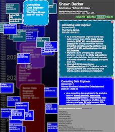

# flock-of-postcards  
# Dark, chaotic, and deep  

The `flock` is a glorified resume describing my own work history and skills over my career timeline.


Large `business cards`are used to describe various jobs, each with its role, 
employer, and time period. These cards are larger, slowing moving, and further away from your view. Each `business card` is surrounded by its flock of
smaller `skill cards`that hovers around them.

Mouse motion over the left side of the window causes your point of view to move around, using`motion parallax` and a fuzzy `depth of field`to give the flock its sense of depth. 

Moving the mouse vertically also causes your view to slide over the `career imeline` shown on the far left edge. 

Click on a `business card` or `skill card` to make it pop it into focus at the top of the flock, and to see its details in the right-hand details area. 

Each job can have a long description, which is defined in an offline-editable Excel spreadsheet. Each description contains related skills, terms, and tools used for that job.

Each skill is marked up in with \[square brackets\] in the spreadsheet description, and is displayed as a clickable link that pops up its `skill card`.

Web links are marked up with \(parens\) in the spreadsheet and are displayed with clickable world wide web icons . 

Image links are marked up with  \{curly braces\} in the spreadheet and are displayed as clickable image icons . 

A `skill card` is created for each \[square\] bracketed phrase in the job description. A skill is typically used over many jobs, so each `skill card` has 
one or more return icons  that serve as clickable links back to jobs that used that skill. The number 
of return icons indicates the number of jobs and the amount of time used to hone that skill.


# Run the `flock-of-postcards` career resume web app using VSCode

## Clone this repo to your local development folder  
`cd <your-local-dev-folder>`
`git clone git@github.com:sbecker11/flock-of-postcards.git`
`cd <your-local-dev-folder>/fock-of-postcards`
 
## Install VSCode + LiverServer  

The `flock-of-postcards` webapp uses ES6 Modules. This requires that you have an ultra lightweight webserver running on your local machine that supports ES6. 

LiveServer is an ultra light weight webserver that works with Google Chrome browser. Installation of Vscode IDE and the LiveServer extension is easy-peasy.  

- Install the  <a href="https://code.visualstudio.com">vscode IDE</a> on your local OS.    
<a href="https://code.visualstudio.com/"></a>

- Start vscode and open the newly cloned `flock-of-postcards` folder in vscode  

- Click the "extensions" icon in the left panel of vscode to search for vscode extensions  
  

- Search for and install vscode's <a href="https://marketplace.visualstudio.com/items?itemName=ritwickdey.LiveServer">LiveServer</a> extension  
<a href="https://marketplace.visualstudio.com/items?itemName=ritwickdey.LiveServer"></a>  


- Click the "explorer" icon at the top left of vscode to explore your local filesystem  
  

- Click the "Go Live" button at the bottom right in vscode to start the vscode-embedded webserver  
 

- Note that the "Go Live" button now shows either "Port : 5500" or "Port : 5501"

- Click the button below that matches the "Go Live" button's new Port value:  
    <a href="http://localhost:5500/index.html"></a>  
    <a href="http://localhost:5501/index.html"></a>  


You should now be up and running with the website's default configuration which shows off MY OWN stellar technology career.

But wouldn't it be better to configure the app to show off your own illustrious career?
 
 # How to customize the webapp to show your own illustrious career

- Go to the project's local home folder
`cd <your-local-dev-folder>/fock-of-postcards`

- Go to jobs folder
`cd static_content/jobs`

- Edit the `jobs.xlsx` Microsoft Excel spreadsheet file

### Customize the Jobs Spreadsheet  

The jobs spreadsheet has one row for each job description. 
Each job description has the following columns that you 
need to fill out:
* role  
* employer  
* start      (YYYY-MM-DD)  
* end        (YYYY-MM-DD)  
* z-index    (from 1 to 3)
* css name	 (darkgreen)
* css RGB	   (#006900)
* css color	 (Excel color background)
* text color (#FFFFFF) or (#000000)
* description  

The `description` cell holds an arbitrary length bulleted job description. As described above, skills, terms, and tools can be wrapped with \[square brackets\] to create a flock of `skill cards` for each `business card`.


### Regenerate the Jobs module  

- Save your updated Excel file

- Go back to your shell and run the python script that converts the Excel jobs spreadsheet file `jobs.xlsx` into a NodeJS module file `jobs.mjs`:
`python xlsx2mjs.py`

If the app is already running, it will re-load the `jobs.mjs` file. 

# Behold your own glorious flock of postcards

## Naming Conventions

This project follows consistent naming conventions to avoid conflicts and improve code clarity:

### File Naming
- **Composables** (Vue reactive functions): `useXxx.mjs`
  - Example: `useViewport.mjs`, `useBullsEye.mjs`, `useFocalPoint.mjs`
- **Modules** (regular JavaScript modules): `xxxModule.mjs`
  - Example: `sceneContainerModule.mjs`, `keyDownModule.mjs`, `parallaxModule.mjs`

### Variable Naming
- **DOM Elements**: `xxxElement`
  - Example: `sceneContainerElement`, `resumeContentDivElement`
- **Imported Modules**: `xxx` (no suffix)
  - Example: `sceneContainer`, `keyDown`, `parallax`
- **Vue Refs**: `xxx` (no suffix)
  - Example: `viewport`, `bullsEye`, `focalPoint`
- **Computed Properties**: `xxx` (no suffix)
  - Example: `focalPointStyle`, `sceneContainerStyle`

### Architecture
The application uses a reactive architecture with Vue composables:
```
viewport → bullsEye → aimPoint → focalPoint
```

**Benefits:**
- Clear distinction between different types of code
- Prevents naming conflicts between DOM elements and imported modules
- Consistent patterns throughout the codebase
- Vue's reactivity system handles all dependency tracking automatically

### Module Initialization

Initialization is handled in `modules/components/AppContent.vue` using Vue's reactive architecture:

Initialization Sequence:
1. Core services (keyDown, sceneContainer)
2. Data controllers (cardsController, resumeItemsController, resumeListController)
3. Assembly (scenePlane, parallax)
4. Layout systems (resizeHandle, timeline)
5. Template rendering (isLoading = false, nextTick)
6. Reactive systems (viewport, bullsEye, aimPoint, focalPoint)
7. Final services (sceneViewLabel, autoScroll)

## Multi-Layered Dependency Management System

This project uses a sophisticated **multi-layered dependency management system** to prevent circular dependencies and maintain clean architecture:

### 1. **Event-Driven Architecture** 
The project uses a sophisticated **event-driven system** to eliminate tight coupling:

- **`eventBus.mjs`**: Central event system for module communication
- **Custom Events**: Components communicate via `CustomEvent` and `EventTarget`
- **Loose Coupling**: Components don't directly import each other, they listen for events

### 2. **InitializationManager with Circular Dependency Detection**
The project has a sophisticated **`InitializationManager`** that:

```javascript
// Prevents circular dependencies at registration time
if (this.wouldCreateCircularDependency(componentName, dependencies)) {
  const cycle = this.findCircularDependency(componentName, dependencies);
  throw new Error(`Circular dependency detected: ${cycle.join(' -> ')}`);
}
```

**Features:**
- **DFS-based cycle detection** using recursion stack
- **Dependency graph validation** 
- **Automatic initialization** when dependencies are ready
- **Event-driven ready notifications**

### 3. **Singleton Pattern Strategy**
The project uses **singleton patterns** to manage global state and prevent dependency cycles:

- **`stateManager`**: Global state singleton
- **`selectionManager`**: EventTarget singleton  
- **`navigationAPI`**: Classic singleton
- **`useViewport`**: Vue composable with singleton pattern

### 4. **Composable Architecture**
Vue composables provide **reactive state management** without circular dependencies:

- **`useColorPalette`**: Color management
- **`useViewport`**: Viewport state
- **`useTimeline`**: Timeline state
- **`useBullsEye`**: BullsEye positioning

### 5. **Module Organization Strategy**
The project uses **strategic module organization**:

```
modules/
├── core/           # Core services (singletons)
├── composables/    # Vue composables (reactive)
├── utils/          # Pure utility functions
├── scene/          # Scene-specific modules
└── resume/         # Resume-specific modules
```

### 6. **Initialization Order Management**
Components register with explicit dependencies:

```javascript
// Example from AppContent.vue
initializationManager.register(
  'Viewport',
  async () => {
    await initializationManager.waitForComponents(['CardsController', 'ResumeListController']);
    viewport.initialize();
  },
  ['CardsController', 'ResumeListController']
);
```

### 7. **Error Boundary System**
**`errorBoundary.mjs`** provides fault tolerance:

- **Component isolation**: Failed components don't break others
- **Event-based error handling**: Components notified via events
- **Graceful degradation**: Disabled components don't cascade failures

## 🎯 **Key Benefits of This Approach**

1. **No Circular Dependencies**: Detection prevents them at registration
2. **Loose Coupling**: Event-driven communication
3. **Predictable Initialization**: Dependency graph ensures correct order
4. **Fault Tolerance**: Error boundaries isolate failures
5. **Maintainable**: Clear separation of concerns
6. **Testable**: Components can be tested in isolation

This architecture ensures that the complex web of dependencies in this visual application remains manageable and doesn't create circular reference issues that could cause runtime errors or infinite loops.

## Hover Flickering Fix for Overlapping Elements

The application contains business card elements (cDivs) that can visually overlap due to their absolute positioning and parallax effects. When multiple cDivs overlap under the mouse cursor, rapid mouseenter/mouseleave events can cause flickering as the elements compete for hover state.

### Problem Analysis
- **Root Cause**: Overlapping absolutely positioned elements receive rapid mouse events
- **Z-index Ineffective**: Unique z-index values don't prevent event conflicts between overlapping elements
- **CSS Transitions Avoided**: Project eschews transitions for immediate state changes
- **Event Competition**: Multiple elements simultaneously trigger hover state changes

### Solution Implementation

The fix uses a **tracked hover state** approach with **DOM reordering** and **event capture**:

#### 1. Tracked Hover State
```javascript
// CardsController.mjs
this.currentlyHoveredElement = null; // Track currently hovered element

// Only process if this is a different element than currently hovered
if (this.currentlyHoveredElement === element) return;
```

#### 2. DOM Reordering Strategy
- **Hovered Element Positioning**: Move hovered cDiv to position N-1 in DOM (just before selected clone at position N)
- **Original Position Tracking**: Store reference to `nextElementSibling` for restoration
- **Atomic Operations**: Use `insertBefore()` for seamless DOM manipulation

```javascript
// Save original position before moving
const originalNextSibling = element.nextElementSibling;
element.setAttribute('data-original-next-sibling', 
  originalNextSibling ? originalNextSibling.getAttribute('data-job-number') : 'null');

// Move to position N-1 (before selected clone)
const lastChild = parent.lastElementChild;
if (lastChild && lastChild !== element) {
  parent.insertBefore(element, lastChild);
}
```

#### 3. Event Capture and Propagation Control
```javascript
// Use capture phase to prevent event conflicts
bizCardDiv.addEventListener('mouseenter', (e) => {
  e.stopPropagation();
  this.handleMouseEnterEvent(bizCardDiv);
}, true); // Capture phase
```

#### 4. Position Restoration
```javascript
// Restore original position on mouseleave
const originalNextSiblingJobNumber = element.getAttribute('data-original-next-sibling');
if (originalNextSiblingJobNumber === 'null') {
  parent.appendChild(element); // Was last child
} else {
  const originalNextSibling = parent.querySelector(`[data-job-number="${originalNextSiblingJobNumber}"]`);
  if (originalNextSibling) {
    parent.insertBefore(element, originalNextSibling);
  }
}
```

### Key Insights
- **DOM Order vs Visual Layer**: DOM reordering doesn't affect visual stacking for absolutely positioned elements (z-index controls visual layer)
- **Event Conflict Prevention**: The fix prevents rapid event switching rather than visual layering conflicts
- **Single Hover Constraint**: Only one element can be hovered at a time, eliminating competition
- **Atomic Operations**: `insertBefore()` automatically removes and repositions elements without changing total child count

### Result
- **No More Flickering**: Overlapping elements no longer compete for hover state
- **Smooth Transitions**: Moving between overlapping elements works seamlessly
- **Preserved Functionality**: All hover behaviors maintained while eliminating flickering
- **Reversible Implementation**: Changes can be easily reverted if needed

This solution demonstrates how event management and DOM manipulation can solve visual interaction issues in complex overlapping UI scenarios.

## Separation of Concerns: Modules, Components, and Composables

This project implements a clear **separation of concerns** across different architectural layers to maintain clean, maintainable code:

### **Modules** (`*.mjs` files)
**Purpose**: Pure business logic and utilities with no UI dependencies

**Characteristics:**
- **Framework-agnostic**: Can be used in any JavaScript environment
- **Stateless**: Focus on pure functions and data processing
- **Reusable**: Can be imported into any other module or component
- **Testable**: Easy to unit test in isolation

**Examples:**
```javascript
// modules/utils/mathUtils.mjs - Pure mathematical functions
export function calculateDistance(point1, point2) { ... }

// modules/core/stateManager.mjs - Global state management
export class StateManager { ... }

// modules/utils/colorUtils.mjs - Color manipulation utilities
export function get_RGB_from_Hex(hex) { ... }
```

**Responsibilities:**
- Data processing and transformation
- Business logic implementation
- Utility functions
- State management
- Event handling

### **Components** (`*.vue` files)
**Purpose**: Vue.js UI components that handle presentation and user interaction

**Characteristics:**
- **Framework-specific**: Built for Vue.js ecosystem
- **Reactive**: Use Vue's reactivity system for UI updates
- **Template-driven**: Combine HTML templates with JavaScript logic
- **Lifecycle-aware**: Leverage Vue's component lifecycle hooks

**Examples:**
```javascript
// modules/components/AppContent.vue - Main application component
export default {
  setup() {
    // Component logic
  },
  template: `<div>...</div>`
}

// modules/components/ResumeContainer.vue - Resume display component
export default {
  props: ['data'],
  emits: ['selection-changed']
}
```

**Responsibilities:**
- UI rendering and presentation
- User interaction handling
- Component lifecycle management
- Props and event communication
- Template logic

### **Composables** (`use*.mjs` files)
**Purpose**: Vue 3 composables that provide reactive state and logic

**Characteristics:**
- **Reactive**: Use Vue's `ref()`, `computed()`, and `watch()`
- **Composable**: Can be combined and reused across components
- **Stateful**: Maintain reactive state across component instances
- **Framework-specific**: Built for Vue 3 Composition API

**Examples:**
```javascript
// modules/composables/useViewport.mjs - Reactive viewport state
export function useViewport() {
  const viewportState = ref({ width: 0, height: 0 });
  const updateViewport = () => { ... };
  return { viewportState, updateViewport };
}

// modules/composables/useColorPalette.mjs - Reactive color management
export function useColorPalette() {
  const currentPalette = ref(null);
  const applyPalette = (element) => { ... };
  return { currentPalette, applyPalette };
}
```

**Responsibilities:**
- Reactive state management
- Cross-component logic sharing
- Side effect handling
- Event subscription management
- Computed property calculations

## Singleton Pattern Implementation Strategy

The project uses **singleton patterns** strategically to manage global state and prevent dependency cycles:

### **When to Use Singletons**

**✅ Good Candidates:**
- **Global state managers**: `stateManager`, `selectionManager`
- **Event systems**: `eventBus`, `navigationAPI`
- **Resource managers**: `viewport`, `colorPalette`
- **Configuration systems**: App settings and preferences
- **Service locators**: Central access points for shared services

**❌ Avoid Singletons For:**
- **UI components**: Use Vue components instead
- **Pure utilities**: Use regular modules
- **Temporary state**: Use composables or component state
- **User-specific data**: Use props or reactive state

### **Singleton Implementation Patterns**

#### **1. Classic Singleton Pattern**
```javascript
// modules/core/stateManager.mjs
class StateManager {
  constructor() {
    if (StateManager.instance) {
      return StateManager.instance;
    }
    StateManager.instance = this;
    this.state = {};
  }
}

const stateManager = new StateManager();
export { stateManager };
```

#### **2. EventTarget Singleton**
```javascript
// modules/core/selectionManager.mjs
class SelectionManager extends EventTarget {
  constructor() {
    super();
    if (SelectionManager.instance) {
      return SelectionManager.instance;
    }
    SelectionManager.instance = this;
    this.selectedItems = new Set();
  }
}

const selectionManager = new SelectionManager();
export { selectionManager };
```

#### **3. Vue Composable Singleton**
```javascript
// modules/composables/useViewport.mjs
let _instance = null;

export function useViewport() {
  if (_instance) {
    return _instance;
  }
  
  const viewportState = ref({});
  const updateViewport = () => { ... };
  
  _instance = { viewportState, updateViewport };
  return _instance;
}
```

### **Singleton Conversion Process**

When converting a class to a singleton pattern:

#### **Step 1: Analysis**
```javascript
// Before: Class with instance
class ResumeItemsController {
  constructor() {
    this.items = [];
    this.isInitialized = false;
  }
}

const resumeItemsController = new ResumeItemsController();
export { resumeItemsController };
```

#### **Step 2: Add Singleton Pattern**
```javascript
// After: Singleton pattern
class ResumeItemsController {
  constructor() {
    if (ResumeItemsController.instance) {
      return ResumeItemsController.instance;
    }
    
    this.items = [];
    this.isInitialized = false;
    
    ResumeItemsController.instance = this;
  }
}

const resumeItemsController = new ResumeItemsController();
export { resumeItemsController };
```

#### **Step 3: Update Dependencies**
```javascript
// Update all imports to use the singleton
import { resumeItemsController } from '../core/resumeItemsController.mjs';

// No need to create new instances
// resumeItemsController is already initialized
```

### **Benefits of This Separation**

1. **Clear Responsibilities**: Each layer has a specific purpose
2. **Testability**: Modules can be tested independently
3. **Reusability**: Logic can be shared across different contexts
4. **Maintainability**: Changes are isolated to specific layers
5. **Performance**: Reactive updates only affect necessary components
6. **Scalability**: New features can be added without affecting existing code

### **Migration Guidelines**

When adding new functionality:

1. **Start with modules** for pure business logic
2. **Use composables** for reactive state management
3. **Create components** for UI presentation
4. **Apply singletons** only for truly global state
5. **Use events** for cross-component communication

This layered approach ensures that the application remains maintainable, testable, and scalable as it grows in complexity.

## ResizeHandle: The Layout Orchestrator

The **resizeHandle** is a sophisticated **20px-wide interactive control panel** that serves as the **central layout orchestrator** for the entire application. It's positioned between the scene and resume containers, providing both **visual separation** and **interactive layout control**.

### **🎯 Novel Innovation: Multi-Functional Control Hub**

The resizeHandle represents a **novel approach to layout management** that goes beyond traditional resize handles by combining **layout control**, **interaction modes**, and **visual feedback** in a single compact interface. This **multi-functional control hub** eliminates the need for separate UI controls while providing intuitive access to the application's core interaction modes.

### **🏗️ Container Hierarchy**

```
app-container (100vw × 100vh)
├── scene-container (dynamic width × 100vh)
├── resume-container (flex layout)
│   ├── resume-container-left (20px fixed)
│   │   └── resize-handle (20px × 100vh)
│   └── resume-container-right (flex-grow)
```

### **🎮 Interactive Features**

#### **Layout Control**
- **Drag to resize**: Click and drag to adjust scene/resume container proportions
- **Percentage-based**: Layout changes are calculated as percentages of total width
- **Smooth transitions**: Layout changes are animated for visual continuity
- **State persistence**: Layout preferences are saved and restored

#### **Interaction Modes**
- **Stepping mode**: Toggle between smooth and stepped layout changes
- **Step count control**: Adjust the number of layout steps (1-10)
- **Visual feedback**: Real-time preview of layout changes
- **Keyboard shortcuts**: Arrow keys for precise layout adjustments

#### **Visual Design**
- **Minimal footprint**: Only 20px wide to maximize content space
- **Hover effects**: Visual feedback on mouse interaction
- **Color integration**: Adapts to current color palette
- **Responsive design**: Adapts to different screen sizes

### **🔧 Technical Implementation**

#### **Composable Architecture**
```javascript
// useResizeHandle.mjs - Core Logic
export function useResizeHandle() {
  const percentage = ref(50); // Default 50/50 split
  const steppingEnabled = ref(false);
  const stepCount = ref(5);
  
  // Layout calculation
  const scenePercentage = computed(() => percentage.value);
  const resumePercentage = computed(() => 100 - percentage.value);
  
  // Event handling
  const handleMouseDown = (event) => {
    // Start drag operation
    startDrag(event.clientX);
  };
  
  const handleMouseMove = (event) => {
    // Update layout during drag
    if (isDragging.value) {
      updateLayout(event.clientX);
    }
  };
}
```

#### **State Management**
```javascript
// State integration with AppState
const updateLayout = (clientX) => {
  const containerWidth = appContainer.clientWidth;
  const newPercentage = (clientX / containerWidth) * 100;
  
  // Apply stepping if enabled
  if (steppingEnabled.value) {
    const stepSize = 100 / stepCount.value;
    const steppedPercentage = Math.round(newPercentage / stepSize) * stepSize;
    percentage.value = Math.max(0, Math.min(100, steppedPercentage));
  } else {
    percentage.value = Math.max(0, Math.min(100, newPercentage));
  }
  
  // Persist to global state
  AppState.resizeHandle.percentage = percentage.value;
  saveState(AppState);
};
```

#### **Event Integration**
```javascript
// Event-driven layout updates
const applyLayout = () => {
  // Update container styles
  sceneContainer.style.width = `${scenePercentage.value}%`;
  resumeContainer.style.width = `${resumePercentage.value}%`;
  
  // Dispatch layout change event
  window.dispatchEvent(new CustomEvent('layoutChanged', {
    detail: {
      scenePercentage: scenePercentage.value,
      resumePercentage: resumePercentage.value
    }
  }));
};
```

### **🎨 Visual Innovations**

#### **Smooth Animations**
- **CSS transitions**: Layout changes are smoothly animated
- **Performance optimized**: Uses transform and opacity for 60fps animations
- **Easing functions**: Natural-feeling animation curves
- **Reduced motion**: Respects user's motion preferences

#### **Responsive Behavior**
- **Minimum widths**: Ensures containers remain usable
- **Maximum widths**: Prevents containers from becoming too large
- **Touch support**: Works with touch devices and mobile
- **Keyboard accessibility**: Full keyboard navigation support

### **🔄 Integration with Application Architecture**

#### **Component Communication**
- **Event-driven updates**: Layout changes trigger events for other components
- **Reactive updates**: Vue reactivity ensures UI consistency
- **State synchronization**: Layout state is synchronized across components
- **Performance monitoring**: Layout changes are optimized for performance

#### **User Experience**
- **Intuitive interaction**: Natural drag-to-resize behavior
- **Visual feedback**: Clear indication of layout changes
- **State persistence**: Layout preferences are remembered
- **Accessibility**: Full keyboard and screen reader support

This **resizeHandle** represents a significant advancement in layout management, providing a **unified interface** for both layout control and interaction mode management while maintaining the application's visual coherence and performance.

## Infinite Scrolling Container: Novel Virtual Scrolling Architecture

This project implements a **sophisticated infinite scrolling system** that provides seamless performance for large datasets while maintaining visual continuity and state preservation. The `InfiniteScrollingContainer` represents a novel approach to virtual scrolling that goes beyond traditional implementations.

### **🎯 Core Innovation: Hybrid Virtual Scrolling**

Unlike traditional virtual scrolling that only renders visible items, this system uses a **hybrid approach** that combines:

- **Virtual positioning**: Items are positioned absolutely with calculated heights
- **Physical rendering**: All items are actually rendered in the DOM
- **Intelligent cloning**: Selected items get clones for interaction
- **State preservation**: Scroll position and selection state are maintained

### **🏗️ Architecture Overview**

```javascript
// InfiniteScrollingContainer.mjs - Core Structure
class InfiniteScrollingContainer {
  constructor() {
    this.allItems = [];           // All items with calculated positions
    this.visibleItems = [];       // Currently visible items
    this.contentHolder = null;    // Scrollable container
    this.scrollport = null;       // Viewport element
    this.itemHeights = new Map(); // Cached height calculations
    this.cloneManager = null;     // Manages item clones
  }
}
```

### **📊 Novel Height Calculation System**

#### **Dynamic Height Measurement**
```javascript
// InfiniteScrollingContainer.mjs - Height Calculation
calculateItemPositions(forceRecalculation = false) {
  let currentTop = 0;
  
  for (const item of this.allItems) {
    if (forceRecalculation || !this.itemHeights.has(item.id)) {
      // Measure natural content height
      item.element.style.height = 'auto';
      item.element.style.minHeight = 'auto';
      
      // Force layout calculation
      void item.element.offsetHeight;
      
      // Get actual content height
      const contentHeight = item.element.scrollHeight;
      this.itemHeights.set(item.id, contentHeight);
    }
    
    const height = this.itemHeights.get(item.id);
    item.top = currentTop;
    item.height = height;
    
    // Apply positioning
    item.element.style.position = 'absolute';
    item.element.style.top = `${currentTop}px`;
    item.element.style.height = `${height}px`;
    
    currentTop += height;
  }
  
  return currentTop;
}
```

#### **Height Caching Strategy**
- **Lazy measurement**: Heights are calculated only when needed
- **Persistent cache**: Heights are stored and reused
- **Force recalculation**: Heights can be recalculated on demand
- **Content-aware**: Adapts to dynamic content changes

### **🎭 Intelligent Clone Management**

#### **Clone Creation System**
```javascript
// InfiniteScrollingContainer.mjs - Clone Management
cloneItem(originalElement, originalIndex, cloneType) {
  const clone = originalElement.cloneNode(true);
  
  // Add clone identifiers
  clone.classList.add('infinite-scroll-clone');
  clone.classList.add(`${cloneType}-clone`);
  clone.dataset.originalIndex = originalIndex;
  clone.dataset.cloneType = cloneType;
  
  // Remove IDs to avoid duplicates
  this.removeIds(clone);
  
  // Apply palette styling to the clone
  if (clone.hasAttribute('data-color-index')) {
    try {
      applyPaletteToElement(clone);
      applyStateStyling(clone, 'normal');
    } catch (error) {
      console.log('Failed to apply palette to infinite scroll clone:', error);
    }
  }
  
  return clone;
}
```

#### **Clone Types**
1. **Selection Clones**: Created when items are selected
2. **Hover Clones**: Created for hover interactions
3. **Interaction Clones**: Created for complex interactions

### **🔄 Advanced Scroll Position Management**

#### **Scroll Position Preservation**
```javascript
// InfiniteScrollingContainer.mjs - Scroll Management
handleScroll() {
  const scrollTop = this.scrollport.scrollTop;
  const scrollHeight = this.scrollport.scrollHeight;
  const clientHeight = this.scrollport.clientHeight;
  
  // Calculate visible range
  const visibleTop = scrollTop;
  const visibleBottom = scrollTop + clientHeight;
  
  // Update visible items
  this.updateVisibleItems(visibleTop, visibleBottom);
  
  // Preserve scroll position during updates
  this.preserveScrollPosition();
}

preserveScrollPosition() {
  // Store current scroll position
  const currentScrollTop = this.scrollport.scrollTop;
  const scrollRatio = currentScrollTop / this.scrollport.scrollHeight;
  
  // After content updates, restore position
  this.scrollport.scrollTop = scrollRatio * this.scrollport.scrollHeight;
}
```

#### **Momentum Scrolling**
```javascript
// InfiniteScrollingContainer.mjs - Momentum System
handleWheel(event) {
  event.preventDefault();
  
  const delta = event.deltaY;
  const currentVelocity = this.currentVelocity || 0;
  
  // Apply momentum
  this.currentVelocity = currentVelocity + delta * 0.1;
  
  // Apply scroll with momentum
  this.scrollport.scrollTop += this.currentVelocity;
  
  // Decay momentum
  this.currentVelocity *= 0.95;
}
```

### **🎨 Visual Continuity Features**

#### **Smooth Transitions**
```javascript
// InfiniteScrollingContainer.mjs - Transition Management
updateVisibleItems(visibleTop, visibleBottom) {
  // Calculate which items should be visible
  const newVisibleItems = this.allItems.filter(item => 
    item.top < visibleBottom && (item.top + item.height) > visibleTop
  );
  
  // Smoothly transition items in/out
  for (const item of this.allItems) {
    const shouldBeVisible = newVisibleItems.includes(item);
    const isCurrentlyVisible = this.visibleItems.includes(item);
    
    if (shouldBeVisible && !isCurrentlyVisible) {
      // Fade in
      item.element.style.opacity = '0';
      item.element.style.display = 'block';
      requestAnimationFrame(() => {
        item.element.style.transition = 'opacity 0.3s ease';
        item.element.style.opacity = '1';
      });
    } else if (!shouldBeVisible && isCurrentlyVisible) {
      // Fade out
      item.element.style.transition = 'opacity 0.3s ease';
      item.element.style.opacity = '0';
      setTimeout(() => {
        item.element.style.display = 'none';
      }, 300);
    }
  }
  
  this.visibleItems = newVisibleItems;
}
```

#### **Content-Aware Styling**
```javascript
// InfiniteScrollingContainer.mjs - Styling Integration
applyItemStyling(item) {
  // Apply palette-based styling
  if (item.element.hasAttribute('data-color-index')) {
    applyPaletteToElement(item.element);
  }
  
  // Apply state-based styling
  if (item.isSelected) {
    applyStateStyling(item.element, 'selected');
  } else if (item.isHovered) {
    applyStateStyling(item.element, 'hovered');
  } else {
    applyStateStyling(item.element, 'normal');
  }
}
```

### **⚡ Performance Optimizations**

#### **Efficient Rendering**
1. **Position Caching**: Item positions are calculated once and cached
2. **Selective Updates**: Only changed items are updated
3. **Debounced Resize**: Resize events are debounced to prevent excessive calculations
4. **RequestAnimationFrame**: Smooth animations using RAF

#### **Memory Management**
```javascript
// InfiniteScrollingContainer.mjs - Memory Optimization
destroy() {
  // Remove event listeners
  this.scrollport.removeEventListener('scroll', this.handleScroll.bind(this));
  this.scrollport.removeEventListener('wheel', this.handleWheel.bind(this));
  
  // Clear timeouts and animations
  if (this.resizeTimeoutId) {
    clearTimeout(this.resizeTimeoutId);
  }
  if (this.momentumAnimationId) {
    cancelAnimationFrame(this.momentumAnimationId);
  }
  
  // Clear content
  this.contentHolder.innerHTML = '';
  
  // Clear caches
  this.itemHeights.clear();
  this.allItems = [];
  this.visibleItems = [];
}
```

### **🎯 Novel Features**

#### **1. Content-Aware Height Calculation**
- **Dynamic measurement**: Heights adapt to content changes
- **Force recalculation**: Heights can be updated on demand
- **Cached results**: Performance optimization through caching

#### **2. Intelligent Clone System**
- **Multiple clone types**: Different clones for different purposes
- **Styling preservation**: Clones maintain visual consistency
- **State synchronization**: Clones stay in sync with originals

#### **3. Advanced Scroll Management**
- **Position preservation**: Scroll position maintained during updates
- **Momentum scrolling**: Natural-feeling scroll physics
- **Smooth transitions**: Items fade in/out smoothly

#### **4. State Integration**
- **Selection preservation**: Selected items remain selected during scroll
- **Visual state**: Hover and selection states are maintained
- **Palette integration**: Items maintain color theming

### **🔄 Integration with Application Architecture**

#### **Event-Driven Updates**
```javascript
// ResumeListController.mjs - Integration
setupInfiniteScrolling() {
  this.infiniteScroller = new InfiniteScrollingContainer();
  this.infiniteScroller.initialize(this.resumeContentDiv, {
    items: this.bizResumeDivs,
    onItemSelect: (item) => {
      selectionManager.selectJobNumber(item.jobNumber, 'InfiniteScroller');
    },
    onScroll: () => {
      // Update scroll position in global state
      AppState.resume.scrollPosition = this.infiniteScroller.getScrollPosition();
      saveState(AppState);
    }
  });
}
```

#### **State Synchronization**
- **Global state**: Scroll position and selection state are persisted
- **Event system**: Changes are communicated via events
- **Reactive updates**: Vue reactivity ensures UI consistency

### **🎨 Visual Innovations**

#### **Seamless Transitions**
- **Opacity transitions**: Items fade in/out smoothly
- **Height animations**: Content changes are animated
- **Clone positioning**: Clones appear/disappear naturally

#### **Performance Indicators**
- **Scroll performance**: 60fps scrolling with large datasets
- **Memory efficiency**: Minimal memory footprint
- **Responsive design**: Adapts to different screen sizes

This **Infinite Scrolling Container** represents a significant advancement in virtual scrolling technology, providing the performance benefits of virtual scrolling while maintaining the visual richness and interaction capabilities of fully rendered content. It's particularly well-suited for applications that require both performance and visual fidelity, such as this resume visualization system.


### Future work

- Provide the option to print the resume to a PDF file
- Need to ease focal point to BullsEye when any skillCardDiv is selected (or clicked?)
- Need to add stamp icons to post cards
- Click on post card to see it's full-size iomage in right-side detail panel
- Render bizCards as 3D blocks with rounded corners
- Rotate 3D bizCard blocks during transitions
- Toggle debug panel visiblilty with button or key


## Development history  

### version 1.1    July 8, 2024  

- Updated installation and customization instructions in README.md
- Deployed latest to github

<a target="_new" href="https://sbecker11.github.io/flock-of-postcards/">https://sbecker11.github.io/flock-of-postcards</a>

### version 1.0    March 8, 2024 

<a target="_new" href="http://spexture.com/">http://spexture.com</a>

- CURRENT_DATE in job [end] replaced with first day of next month but displayed as 'working'
- Always scroll newly selected bizCardDiv (and optionally its bizCardLineItem) into view in selectTheBizCard
- not started 
  in highlightTheDivCardBackArrow 
    unhighlightTheHighlightedDivCardBackArrow 
    update theHighlightedDivCardBackArrow
    find the CardDivLineItemTagSpan of theHighlightedDivCardBackArrow 
    call highlightTheCardDivLineItemTagSpan
   in highlightTheCardDivLineItemTagSpan
    unhighlightTheHighlightedCardDivLineItemTagSpan
    update theHighlightedCardDivLineItemTagSpan
    find the cardDivCardBackArrow of theHighlightedCardDivLineItemTagSpan
    call highlightTheCardDivCardBackArrow

### version 0.9:   January 4, 2024

### version 0.8:   January 1, 2024


### version 0.7:   November 18, 2023

- Default timeline year avg of min-max years
- Auto-computing timeline min-max years
- Interpolating CURRENT_DATE  in xlsx file
- GoLive link with port 5500 or 5501
- applying parallax on the target for restoreSavedStyle
- replaced addAimationEndListener with endAnimation on a timeout
- BizCards are now animating to the top, but not staying there
- Bizdards return to original position after losing focus
- fixed selectNextBizCard
- added links to three.mjs examples
- added links to Virtual Munsell Color Wheel
- added select all skills button
- added selectNext, selectAll, and clearAll buttons


### version 0.6:   July 3, 2023  

- Upgraded static website to use ES6 modules, thus requiring a local webserver that supports ES6.  
- The focal point now eases towards the mouse when it enters the scene-plane area.  
- The focal point now eases toward the bullsEye when it leaves the scene-plane areas.  
-  8 MB animated gif</a>


### version 0.5:   June 26, 2023

- A flock of small skill postcards and larger business cards float over the left-side scene-plane column.
- A timeline is displayed at ground level, to visualize the date range of employment for each business card.
- A 3-D parallax effect on cards is controlled by the "focalPoint", which tracks the mouse while over the scene-plane.
- Add line items to the right-side resume column by selecting business cards.
- Select a postcard or resume line item by clicking it, click again to deselect it.
- Selected postcards and line-items have a red-dashed border.
- Once selected, a postcard or business card is temporarily moved above the flock where is not subject to motion parallax.
- Click on a postcard to select and scroll its resume line item into view.
- Click on a resume line item to select and scroll its postcard into view.
- The scene-plane viewPort shows "BullsEye" with a plus sign at scene-plane center, where parallax effect is zero.
- FocalPoint defaults back to the viewPort center BullsEye when it leaves the scene-plane.
- The focalPoint starts tracking the mouse as soon as it re-enters the scene-plane area.
- Scene-div auto-scrolling starts when the focalPoint is in top or bottom quqrter of the scene-plane.
- Autoscrolling stops when the focalPoint moves to viewPort center and when the mouse leaves the scene-plane.
- Click on a resume line item's top-right delete button to delete it.
- Click on the bottom-right green next button to open and select the resume line item for the next business card.
- Skill postcards inherit the color of its parent business card.
- Click the underlined text in a business cards resume line item to select and bring that skill postcard into view over the flock.


### version 0.4:   June 18, 2023

- scripted process to convert WordPress media dump xml file into a javascript file of img paths of resized local img files (not included in github) for html inclusion.
- scripted process to convert excel jobs.xlsx spreadsheet file (included in github) into a javascript file of job objects for html inclusion.
- right side now has fixed header and footer and an auto-scolling content.
- click on a any postcard or underlying buisness card to add a new deleteble line item to the right column.


### version 0.3:   June 7, 2023

- downloads bizCards from local jobs.csv file  
  - BUT only works when running local instance of http-server from the version3 folder  
- click on a red-div to open a new pink line-item in the resume-container  


### version 0.2:   June 6, 2023

- faded timeline on right side
- linear gradiens at top and bottom
- bizCards are purple and far away from viewer
- cards are red and closer to viewer
- cards turn yellow on rollover  
- horizontal and vertical mouse motion induce motion parallax
- parallax decreases as distance to viewer increases
- manual vertical scrolling is supported though scrollbar is invisible
- scene-plane scrolls vertically when mouse approaches top and bottom
- right column for diagnostics


### version 0.1 - May 23, 2023

- randomized div sizes, locations, and z-index
- z-index affects opacity and brightness
- autogenerated imgs from web
- vertical stack of divs moved to scene-container center on load and resize
- vertical scrollbar
- fat middle line for diagnositcs
- right column for diagnostics

